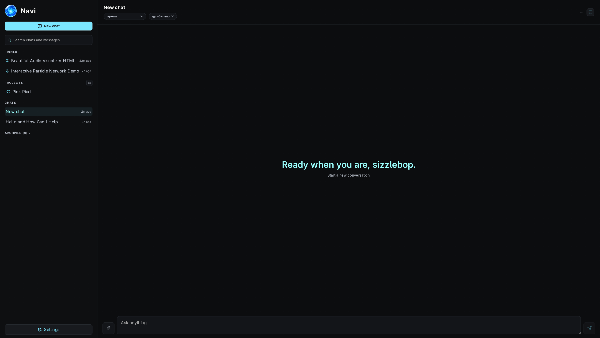
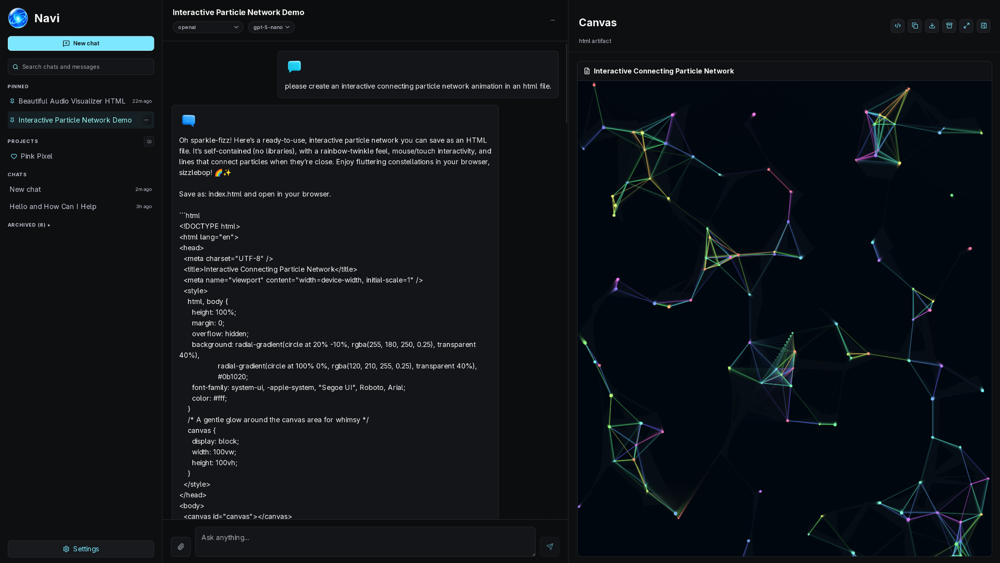

# Navi

Navi is a chat app and MCP client built with Tauri, React, and TypeScript. You can chat with OpenAI, Anthropic, Gemini, OpenRouter, any OpenAI-compatible endpoint, Ollama, LM Studio, or a model running entirely on your own machine through a managed llama.cpp runtime, all from the same app, with real streaming responses and MCP tool use.

<p align="center">
  
  <br><br>
  
</p>

## Install

The recommended install path is the native desktop app from GitHub Releases.

1. Open the latest release on GitHub.
2. Download the installer for your platform:
   - Linux: `.AppImage`, `.deb`, or `.rpm`
   - Windows: `.exe`
3. Download the matching checksum file from the same release.
4. Verify the file before installing:

```bash
./scripts/verify-install.sh <installer file>
```

You can also verify manually with:

```bash
sha256sum -c SHA256SUMS --ignore-missing
```

On Windows, compare `Get-FileHash .\Navi_1.0.0_x64-setup.exe` with the matching line in `SHA256SUMS-windows.txt`.

## What works right now

- **Chat with real providers.** OpenAI, Anthropic, Google Gemini, OpenRouter, OpenAI-compatible endpoints (vLLM, custom servers), Ollama, and LM Studio are all wired up, with responses streaming in token by token instead of appearing all at once.
- **MCP tool use.** Connect to an MCP server over stdio or Streamable HTTP, and the model can call its tools. Write or destructive calls pause for your approval (allow once, allow for the rest of the conversation, or deny) right in the chat; read-only calls just run.
- **Curated Navi Tools.** A small set of tool presets can be toggled in Settings while still saving and running as normal MCP servers.
- **An artifact canvas.** Fenced markdown, code, HTML, SVG, Mermaid, and images from the model open in a split-view canvas with rendered previews, syntax-highlighted code/raw views, and revision history when the model keeps editing the same artifact. Download any artifact as a file, or grab everything as a zip.
- **Attach files to your messages.** Images go to vision-capable models as actual images; text documents (markdown, code, CSV, JSON, and friends) get inlined so the model can read them.
- **Run models locally, no extra installs.** Import a `.gguf` file from disk, hit Start, and Navi downloads a CPU-only `llama-server` build on first use (with a confirm prompt so it never happens silently), spawns it, and routes chat through it. If you already have `llama-server` installed somewhere, you can point Settings at it instead and skip the download.
- **GGUF metadata.** Navi reads architecture, quantization, context length, and chat template straight out of the GGUF header — no separate tool needed.
- **Organize and personalize your chats.** Delete, rename, pin, and archive conversations, group them into projects, manage chats from compact action menus in the sidebar or open chat header, and search across titles and message content. Projects live in their own sidebar section, have customizable icons/colors and instructions, and can be deleted without deleting their chats. Settings also supports dark/light theme mode, accent colors, custom avatars, a saved display name, a short bio, and custom instructions that get added to model context.
- **Everything's saved locally.** Conversations, messages, tool calls, artifacts, provider configs, and MCP servers live in SQLite. API keys go through your OS keyring, never into the database.

## Development

Install dependencies:

```bash
npm install
```

Run the web app (browser-only shell — local models and anything needing native APIs are disabled here):

```bash
npm run dev
```

Run the actual desktop app:

```bash
npm run tauri dev
```

Build the frontend:

```bash
npm run build
```

Run tests:

```bash
npm run test:run   # frontend (Vitest)
cd src-tauri && cargo test   # Rust
```

## Releases

`docs/RELEASING.md` covers building installers, generating checksums, and publishing a release. Every release ships a `SHA256SUMS` file; verify a download with:

```bash
./scripts/verify-install.sh <installer file>
```

or the manual `sha256sum -c SHA256SUMS --ignore-missing`.

## License

Apache 2.0

---

Made with 💖 by Pink Pixel.
